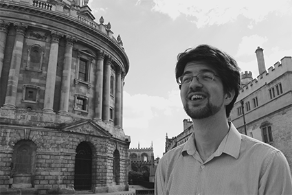

# About

I am a theoretical linguist: I aim to understand how human language
works by coming up with theories about it and then testing them. In
particular, I am interested in the structure of sentences (syntax), how
the meanings of sentences are computed (semantics), and the ways in
which these two interact.

Professionally, I am a Post-Doctoral Research Fellow in Semantics at the
University of Oslo, working on the [Universal Natural Language
Understanding
project](https://www.hf.uio.no/iln/english/research/projects/universal-natural-language-understanding/index.html).
Prior to this, I was a Departmental Lecturer at the University of
Oxford, where my teaching included general linguistics, syntax, and
sociolinguistics.

Research-wise, I am interested in well-formalised theories of grammar
and meaning, especially constraint-based, non-derivational theories
(such as Lexical Functional Grammar and Glue Semantics). I\'m also
always keen for opportunities to explore the relationships between
different linguistic theories -- where they diverge and how testable
those differences are.

My recent work has mostly focussed on the syntax and semantics of idioms
and other multiword expressions, investigating how they should be
represented in the mental lexicon. I also study the principles behind
how the semantic arguments of a predicate are realised syntactically,
otherwise known as Mapping Theory.

Beyond syntax and semantics, I am interested in sociolinguistics, and
especially in the intersection of language, gender, and sexuality.

Outside of linguistics, I enjoy techy things (I\'m currently playing
around with Emacs again \...), strategy games (of both the board and PC
variety), and bad puns (\"You have a daughter don\'t you?\" \"Yea,
Henrietta\" \"Did he? I\'m sorry to hear that\").
